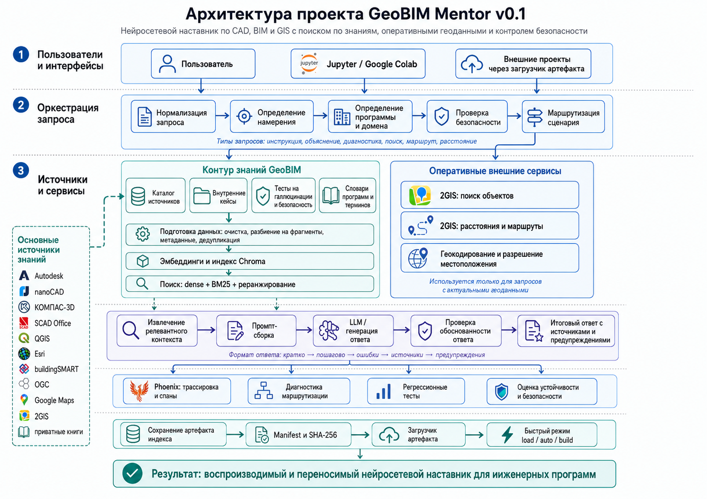
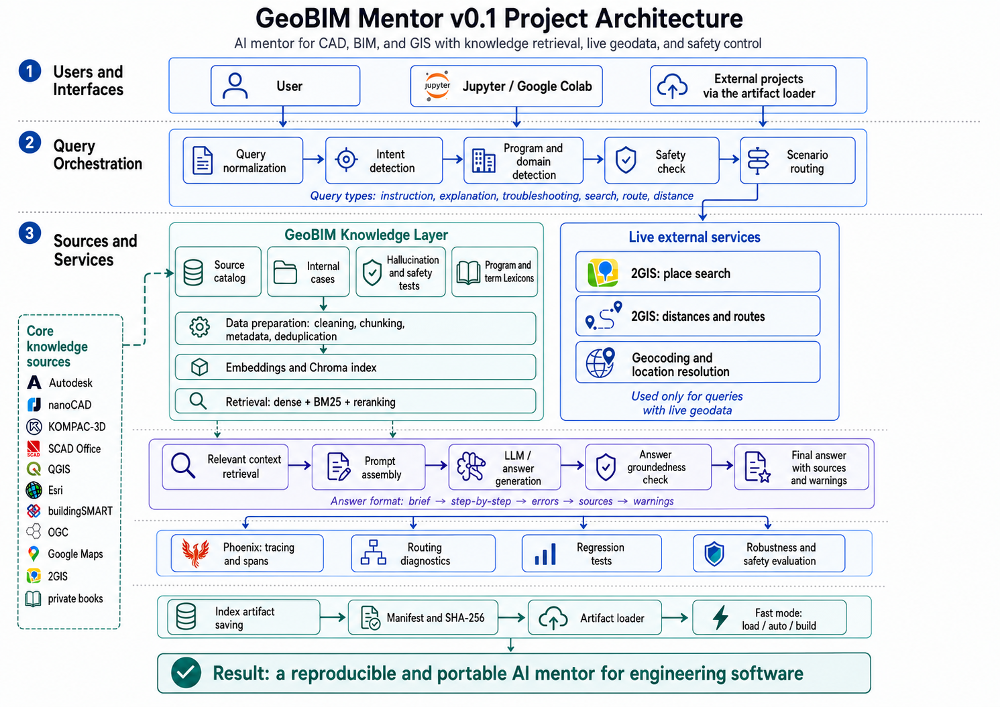

# GeoBIM Mentor v0.1

**Русский** | [English](#en)

GeoBIM Mentor - это исследовательский AI-проект для консультаций по CAD, BIM, GIS, геодезии и инженерному программному обеспечению. Система анализирует запрос пользователя, определяет программу и намерение, ищет подтверждения в базе знаний, проверяет безопасность, снижает риск галлюцинаций и при необходимости обращается к актуальным данным 2GIS.

Проект построен как воспроизводимый RAG-конвейер: LlamaIndex, Chroma, BGE-M3 embeddings, гибридный поиск, реранжирование, локальная языковая модель, safety-фильтры, Phoenix-трассировка и переносимый runtime-артефакт для быстрого повторного запуска. Такой подход выбран как более проверяемая и управляемая альтернатива обычному чату с языковой моделью без источников и диагностики.

### Ноутбуки

- [Русская версия ноутбука](notebooks/GeoBIM_Mentor_v0_1_RU.ipynb)
- [English notebook version](notebooks/GeoBIM_Mentor_v0_1_EN.ipynb)

> Версия 0.1 является исследовательским и демонстрационным прототипом. Ответы системы не заменяют инженерную проверку, актуальные нормативные документы и решение ответственного специалиста.

---

## Содержание

- [Назначение проекта](#ru-purpose)
- [Архитектура](#ru-architecture)
- [Основные возможности](#ru-features)
- [Файлы и архивы данных](#ru-files)
- [Приватные книги](#ru-private-books)
- [Быстрый запуск](#ru-quick-start)
- [Режимы работы](#ru-run-modes)
- [Сохранение и загрузка артефактов](#ru-artifacts)
- [Подключение к другому проекту](#ru-loader)
- [Переменные окружения](#ru-env)
- [Проверки качества](#ru-tests)
- [Ограничения версии 0.1](#ru-limitations)
- [План развития](#ru-roadmap)
- [Лицензирование](#ru-license)

<a id="ru-purpose"></a>

## Назначение проекта

GeoBIM Mentor предназначен для консультаций по инженерному программному обеспечению и смежным прикладным задачам. Система помогает пользователю:

- получать объяснения по CAD, BIM, GIS и расчетным программам;
- находить общий порядок работы в AutoCAD, Civil 3D, Revit, QGIS, SCAD Office, nanoCAD, КОМПАС-3D и других программах;
- диагностировать типовые проблемы, например с параметрами Revit, системами координат или подготовкой расчетной модели;
- отличать команды и функции разных программ, чтобы не переносить возможности AutoCAD в Revit, Civil 3D в QGIS и наоборот;
- выполнять ограниченные live-запросы к 2GIS для поиска организаций, координат, расстояний и маршрутов;
- получать безопасные отказы на запросы, связанные с обходом лицензий, кражей ключей, разрушительными действиями, вредоносным кодом и неподтвержденными инженерными выводами.

Проект сделан в формате Jupyter / Google Colab notebook, чтобы его можно было изучать, запускать и расширять без отдельного серверного развертывания.

<a id="ru-architecture"></a>

## Архитектура

<p align="center">
  
</p>

Архитектура состоит из нескольких уровней:

1. **Интерфейс пользователя** - Jupyter / Google Colab, ручной чат и возможность подключения готового артефакта из другого проекта.
2. **Оркестрация запроса** - нормализация текста, определение намерения, определение программы и предметной области, проверка безопасности, выбор сценария обработки.
3. **Контур знаний** - каталог источников, внутренние кейсы, словари, тесты, очистка данных, разбиение на фрагменты, метаданные, дедупликация, embeddings и индекс Chroma.
4. **Оперативные внешние сервисы** - 2GIS Places API, Distance Matrix API, геокодирование и разрешение местоположения.
5. **Формирование ответа** - извлечение релевантного контекста, сборка промпта, генерация ответа, проверка обоснованности, итоговый ответ с источниками и предупреждениями.
6. **Наблюдаемость и качество** - Phoenix, диагностические таблицы, регрессионные тесты, проверка устойчивости и безопасности.
7. **Повторный запуск и переносимость** - сохранение Chroma в ZIP-артефакт, manifest, SHA-256, загрузчик артефакта и режимы `auto`, `load`, `build`.

<a id="ru-features"></a>

## Основные возможности

- **Межпрограммная маршрутизация**: система определяет, к какой программе или технологии относится запрос.
- **RAG-поиск**: ответы строятся на основе извлеченных фрагментов базы знаний и, при необходимости, ограниченных знаний модели.
- **Гибридный поиск**: dense retrieval, BM25 и реранжирование помогают повысить релевантность источников.
- **Словари программ и терминов**: используются aliases, domain terms, weak terms и межпрограммные ограничения.
- **2GIS-интеграция**: поиск объектов, координат, расстояний и маршрутов по актуальным данным внешнего сервиса.
- **Контроль безопасности**: блокируются опасные запросы и сценарии злоупотребления.
- **Контроль галлюцинаций**: проверяется наличие достаточных доказательств и риск неподтвержденных утверждений.
- **Phoenix-трассировка**: этапы обработки запроса отображаются как трассы и спаны.
- **Переносимый runtime-артефакт**: готовый индекс можно сохранить и использовать без повторного построения.
- **Приватный слой знаний**: можно подключать локальные книги и внутренние документы без публикации исходных PDF.

<a id="ru-files"></a>

## Файлы и архивы данных

| Файл | Назначение |
|---|---|---|
| `GeoBIM_Mentor_v0_1_RU.ipynb` | Основной русский notebook проекта |
| `GeoBIM_Mentor_v0_1_EN.ipynb` | Английская версия notebook | 
| `geobim_artifact_loader_v0_1.py` | Автономный загрузчик готового Chroma-индекса | 
| `geobim_internal_cases_v0_1.zip` | Внутренние учебные кейсы по CAD/BIM/GIS | 
| `geobim_tests_v0_1.zip` | Тесты безопасности, маршрутизации, 2GIS и галлюцинаций |
| `geobim_lexicons_v0_1.zip` | Словари терминов, программ, ограничений и safety-правил |
| `program_aliases_v0_1.json` | Реестр программ, aliases, domain terms и weak terms |
| `sources_catalog_v0_1_geobim_mentor.csv` | Каталог открытых и внутренних источников |
| `manifest_v0_1.json` | Манифест исходного комплекта данных |
| `GEOBIM.zip` | Приватные книги и каталог книг |
| `geobim_mentor_runtime_v0_1_public.zip` | Готовый публичный индекс без приватных книг |
| `geobim_mentor_runtime_v0_1_local_only.zip` | Готовый индекс с производными приватных фрагментов |

<a id="ru-private-books"></a>

## Приватные книги

Приватные PDF можно подключать через архив `GEOBIM.zip` или через переменную окружения `GEOBIM_PRIVATE_BOOKS_SOURCE`. Этот слой нужен для расширения базы знаний учебниками, внутренними инструкциями и корпоративными материалами.

Безопасные правила работы с приватной базой:

- не публиковать исходные PDF;
- не публиковать `GEOBIM.zip`;
- не публиковать `local_only`-артефакты;
- хранить ссылки и ключи в Colab Secrets или переменных окружения;
- отделять публичный индекс от приватного;
- проверять права на использование документов до индексации.

<a id="ru-quick-start"></a>

## Быстрый запуск

### 1. Клонируйте репозиторий

```bash
git clone https://github.com/<your-user>/<your-repo>.git
cd <your-repo>
```

### 2. Откройте notebook

Откройте один из файлов:

```text
GeoBIM_Mentor_v0_1_RU.ipynb
GeoBIM_Mentor_v0_1_EN.ipynb
```

Рекомендуемая среда для полного построения индекса - Google Colab с GPU.

### 3. Задайте секреты

Для полного режима могут понадобиться:

```text
HF_TOKEN
OPENAI_API_KEY
DGIS_API_KEY
```

В Colab их лучше хранить в **Secrets**, а не в коде notebook.

### 4. Выберите режим запуска

Для первого построения публичной базы:

```python
import os

os.environ["GEOBIM_RUN_MODE"] = "build"
os.environ["GEOBIM_ENABLE_PRIVATE_BOOKS"] = "0"
os.environ["GEOBIM_EXPORT_ARTIFACT"] = "1"
os.environ["GEOBIM_DGIS_ACCESS_MODE"] = "demo_key"
```

Для быстрого запуска из готового артефакта:

```python
import os

os.environ["GEOBIM_RUN_MODE"] = "load"
os.environ["GEOBIM_ARTIFACT_SOURCE"] = "/content/geobim_mentor_runtime_v0_1_public.zip"
os.environ["GEOBIM_EXPORT_ARTIFACT"] = "0"
```

Для локального артефакта с приватными книгами:

```python
import os

os.environ["GEOBIM_RUN_MODE"] = "load"
os.environ["GEOBIM_ARTIFACT_SOURCE"] = "/content/geobim_mentor_runtime_v0_1_local_only.zip"
os.environ["GEOBIM_ALLOW_LOCAL_ONLY_ARTIFACT"] = "1"
os.environ["GEOBIM_ENABLE_PRIVATE_BOOKS"] = "0"
os.environ["GEOBIM_EXPORT_ARTIFACT"] = "0"
```

<a id="ru-run-modes"></a>

## Режимы работы

| Режим | Назначение |
|---|---|
| `build` | Полностью строит базу знаний, индекс Chroma и экспортирует runtime-артефакт |
| `load` | Загружает готовый runtime-артефакт без повторной индексации |
| `auto` | Пытается загрузить совместимый артефакт, а при отсутствии переходит к построению |

Режим `load` экономит время, потому что пропускает загрузку источников, извлечение текста, разбиение на фрагменты, дедупликацию и расчет embeddings. При этом embedding-модель все равно нужна для кодирования новых запросов пользователя.

<a id="ru-artifacts"></a>

## Сохранение и загрузка артефактов

После успешного режима `build` notebook создает один из архивов:

```text
geobim_mentor_runtime_v0_1_public.zip
geobim_mentor_runtime_v0_1_local_only.zip
```

Артефакт содержит:

- готовую базу Chroma;
- manifest с параметрами построения;
- SHA-256 для проверки целостности;
- служебные открытые файлы;
- requirements для загрузчика;
- standalone-loader.

Артефакт не содержит:

- API-ключей;
- токенов;
- весов моделей;
- исходных приватных PDF;
- traces Phoenix;
- истории диалогов.

<a id="ru-loader"></a>

## Подключение к другому проекту

Для подключения поискового слоя GeoBIM Mentor к другому проекту нужны:

```text
geobim_mentor_runtime_v0_1_public.zip
geobim_artifact_loader_v0_1.py
```

Пример:

```python
from geobim_artifact_loader_v0_1 import load_geobim_artifact

runtime = load_geobim_artifact(
    "geobim_mentor_runtime_v0_1_public.zip",
    device="cuda",
)

rows = runtime.retrieve_dicts(
    "How do I check a layer coordinate reference system in QGIS?",
    top_k=5,
)

for row in rows:
    print(row["score"], row["text"][:500])
```

Standalone-loader открывает только retrieval-слой. Полный контур GeoBIM Mentor - маршрутизация, безопасность, генерация, judges, 2GIS и Phoenix - остается в notebook.

<a id="ru-env"></a>

## Переменные окружения

| Переменная | Назначение |
|---|---|
| `GEOBIM_RUN_MODE` | Режим `auto`, `load` или `build` |
| `GEOBIM_ARTIFACT_SOURCE` | Путь или ссылка на готовый runtime ZIP |
| `GEOBIM_PROJECT_DIR` | Рабочий каталог проекта |
| `GEOBIM_SOURCE_DIR` | Дополнительная папка с исходными файлами |
| `GEOBIM_ENABLE_PRIVATE_BOOKS` | Включить приватные PDF |
| `GEOBIM_PRIVATE_BOOKS_SOURCE` | Путь, URL или Google Drive file id приватного архива |
| `GEOBIM_ALLOW_LOCAL_ONLY_ARTIFACT` | Разрешить загрузку приватного local-only артефакта |
| `GEOBIM_EXPORT_ARTIFACT` | Экспортировать runtime ZIP после build |
| `GEOBIM_ENABLE_OPENAI_JUDGE` | Включить внешний judge при наличии ключа |
| `GEOBIM_OPENAI_JUDGE_MODEL` | Выбрать модель для проверки ответов |
| `GEOBIM_DGIS_ACCESS_MODE` | Режим доступа к 2GIS: `no_key`, `demo_key`, `subscription_key` |
| `GEOBIM_ENABLE_PHOENIX` | Включить Phoenix tracing |
| `HF_TOKEN` | Токен Hugging Face, если нужен для загрузки моделей |
| `OPENAI_API_KEY` | Ключ OpenAI для judge-моделей |
| `DGIS_API_KEY` | Ключ 2GIS |

<a id="ru-tests"></a>

## Проверки качества

В проект включены наборы проверок:

- базовая проверка безопасности;
- регрессионная проверка безопасности;
- проверка безопасной маршрутизации;
- базовая проверка галлюцинаций;
- регрессионная проверка галлюцинаций;
- проверка разборщика 2GIS;
- итоговые демонстрационные запросы;
- ручной консольный чат.

Тесты позволяют проверить, что система не выдает вредоносные инструкции, не раскрывает секреты, не подтверждает выдуманные команды и корректно различает сценарии обработки. В версии 0.1 тесты являются важной диагностикой, но не доказывают промышленную надежность системы.

<a id="ru-limitations"></a>

## Ограничения версии 0.1

- Проект является прототипом, а не производственной системой.
- Не все решения итогового judge пока используются как жесткий фильтр публикации ответа.
- Технический статус `ok` от 2GIS не всегда гарантирует смысловую релевантность найденных организаций.
- Словари и правила требуют расширения: ФИАС/ГАР, КЛАДР, категории организаций, типы проектируемых объектов, команды программ и версии интерфейса.
- Некоторые безопасные вопросы могут ошибочно блокироваться.
- Некоторые смежные инженерные вопросы могут ошибочно считаться выходящими за область проекта.
- Качество результата зависит от выбранной языковой модели и от того, передается ли ей неоднозначный запрос.

<a id="ru-roadmap"></a>

## План развития

Приоритетные направления:

1. Сделать итогового judge обязательным шлюзом перед публикацией ответа.
2. Добавить семантическую проверку результатов 2GIS.
3. Расширить словари ФИАС/ГАР, КЛАДР, ОКТМО, ОКАТО и справочники категорий организаций.
4. Создать реестры команд и функций по каждой программе и версии.
5. Добавить типы проектируемых объектов: высотные здания, мосты, дороги, аэродромы, инженерные сети, промышленные объекты.
6. Расширить приватную базу знаний корпоративными регламентами, учебниками, типовыми ошибками и проверенными инструкциями.
7. Разделить `requested_program`, `referenced_program`, `command_owner_candidate` и `cross_program_conflict`.
8. Вынести код из notebook в Python-пакет.
9. Добавить API и веб-интерфейс.
10. Усилить защиту от многошаговых атак, prompt injection и утечки секретов.

<a id="ru-license"></a>

## Лицензирование

Код проекта, внутренние кейсы и конфигурации должны распространяться только в рамках выбранной лицензии репозитория. Внешние библиотеки, модели, документация производителей, 2GIS, OpenAI, Hugging Face и другие сервисы используются по их собственным лицензиям и условиям использования.

Приватные книги и производные local-only артефакты не предназначены для публичного распространения.

---

<a id="en"></a>

## English

**GeoBIM Mentor v0.1** is an educational and applied AI mentor for CAD, BIM, GIS, surveying, and construction engineering workflows. The project combines RAG-based knowledge retrieval, query routing, safety filtering, hallucination control, live 2GIS requests, Phoenix tracing, and portable retrieval artifacts for fast repeated runs.

> Version 0.1 is a research and demonstration prototype. System answers do not replace engineering review, current regulations, or approval by a responsible specialist.

<p align="right"><a href="#ru">Переключиться на русский</a></p>

---

## Contents

- [Project purpose](#en-purpose)
- [Architecture](#en-architecture)
- [Key features](#en-features)
- [Files and data archives](#en-files)
- [Private books](#en-private-books)
- [Quick start](#en-quick-start)
- [Run modes](#en-run-modes)
- [Artifact saving and loading](#en-artifacts)
- [Using GeoBIM Mentor in another project](#en-loader)
- [Environment variables](#en-env)
- [Quality checks](#en-tests)
- [Version 0.1 limitations](#en-limitations)
- [Roadmap](#en-roadmap)
- [Licensing](#en-license)

<a id="en-purpose"></a>

## Project purpose

GeoBIM Mentor is designed to support engineering software consulting and related applied tasks. The system helps users:

- get explanations for CAD, BIM, GIS, and structural-analysis software;
- find general workflows for AutoCAD, Civil 3D, Revit, QGIS, SCAD Office, nanoCAD, KOMPAS-3D, and other tools;
- troubleshoot common issues, such as Revit parameters, coordinate reference systems, or model-checking workflows;
- distinguish commands and features across different software products;
- avoid transferring AutoCAD commands into Revit, Civil 3D concepts into QGIS, or Revit parameters into KOMPAS-3D without validation;
- perform limited live 2GIS requests for place search, coordinates, distances, and routes;
- safely refuse requests involving license bypass, credential theft, destructive operations, malicious code, and unsupported engineering-safety conclusions.

The project is implemented as a Jupyter / Google Colab notebook so it can be studied, executed, and extended without a dedicated server deployment.

<a id="en-architecture"></a>

## Architecture

<p align="center">
  
</p>

The architecture consists of several layers:

1. **User interface** - Jupyter / Google Colab, manual console chat, and optional reuse of a saved retrieval artifact in another project.
2. **Query orchestration** - text normalization, intent detection, program and domain detection, safety checking, and scenario routing.
3. **Knowledge layer** - source catalog, internal cases, lexicons, tests, data cleaning, chunking, metadata, deduplication, embeddings, and Chroma index.
4. **Live external services** - 2GIS Places API, Distance Matrix API, geocoding, and location resolution.
5. **Answer generation** - relevant-context retrieval, prompt assembly, answer generation, groundedness checking, and final answer with sources and warnings.
6. **Observability and quality** - Phoenix traces, diagnostic tables, regression tests, robustness and safety checks.
7. **Repeatability and portability** - Chroma export to a ZIP artifact, manifest, SHA-256 hashes, artifact loader, and `auto`, `load`, `build` modes.

<a id="en-features"></a>

## Key features

- **Cross-program routing**: the system identifies the software product or technology mentioned in a query.
- **RAG retrieval**: answers are based on retrieved knowledge-base fragments and, when necessary, bounded model prior knowledge.
- **Hybrid retrieval**: dense retrieval, BM25, and reranking improve evidence relevance.
- **Program and term lexicons**: aliases, domain terms, weak terms, and cross-program constraints are used for routing.
- **2GIS integration**: place search, coordinates, distances, and routes are retrieved from a live external service.
- **Safety control**: harmful requests and abuse scenarios are blocked.
- **Hallucination control**: the system checks evidence sufficiency and the risk of unsupported claims.
- **Phoenix tracing**: request-processing stages are recorded as traces and spans.
- **Portable runtime artifact**: the built index can be saved and loaded without rebuilding.
- **Private knowledge layer**: private books and internal documents can be indexed without publishing raw PDFs.

<a id="en-files"></a>

## Files and data archives

| File | Purpose |
|---|---|---|
| `GeoBIM_Mentor_v0_1_RU.ipynb` | Main Russian notebook |
| `GeoBIM_Mentor_v0_1_EN.ipynb` | English notebook
| `geobim_artifact_loader_v0_1.py` | Standalone loader for the saved Chroma index
| `geobim_internal_cases_v0_1.zip` | Internal educational cases for CAD/BIM/GIS |
| `geobim_tests_v0_1.zip` | Safety, routing, 2GIS, and hallucination tests |
| `geobim_lexicons_v0_1.zip` | Term, program, constraint, and safety lexicons |
| `program_aliases_v0_1.json` | Program registry with aliases, domain terms, and weak terms |
| `sources_catalog_v0_1_geobim_mentor.csv` | Catalog of open and internal sources |
| `manifest_v0_1.json` | Manifest for the seed data pack |
| `GEOBIM.zip` | Private books and book catalog |
| `geobim_mentor_runtime_v0_1_public.zip` | Ready public index without private books |
| `geobim_mentor_runtime_v0_1_local_only.zip` | Ready index with private-derived fragments |

<a id="en-private-books"></a>

## Private books

Private PDFs can be connected through `GEOBIM.zip` or the `GEOBIM_PRIVATE_BOOKS_SOURCE` environment variable. This layer is intended for expanding the knowledge base with textbooks, internal instructions, and corporate materials.

Safe handling rules:

- do not publish raw PDFs;
- do not publish `GEOBIM.zip`;
- do not publish `local_only` artifacts;
- store links and keys in Colab Secrets or environment variables;
- separate the public index from the private index;
- verify document-use rights before indexing.

<a id="en-quick-start"></a>

## Quick start

### 1. Clone the repository

```bash
git clone https://github.com/<your-user>/<your-repo>.git
cd <your-repo>
```

### 2. Open the notebook

Open one of the notebooks:

```text
GeoBIM_Mentor_v0_1_RU.ipynb
GeoBIM_Mentor_v0_1_EN.ipynb
```

Google Colab with a GPU is recommended for a full index build.

### 3. Configure secrets

A full run may require:

```text
HF_TOKEN
OPENAI_API_KEY
DGIS_API_KEY
```

In Colab, store them in **Secrets**, not directly in notebook code.

### 4. Select the run mode

For the first public build:

```python
import os

os.environ["GEOBIM_RUN_MODE"] = "build"
os.environ["GEOBIM_ENABLE_PRIVATE_BOOKS"] = "0"
os.environ["GEOBIM_EXPORT_ARTIFACT"] = "1"
os.environ["GEOBIM_DGIS_ACCESS_MODE"] = "demo_key"
```

For a fast run from a ready artifact:

```python
import os

os.environ["GEOBIM_RUN_MODE"] = "load"
os.environ["GEOBIM_ARTIFACT_SOURCE"] = "/content/geobim_mentor_runtime_v0_1_public.zip"
os.environ["GEOBIM_EXPORT_ARTIFACT"] = "0"
```

For a local artifact with private books:

```python
import os

os.environ["GEOBIM_RUN_MODE"] = "load"
os.environ["GEOBIM_ARTIFACT_SOURCE"] = "/content/geobim_mentor_runtime_v0_1_local_only.zip"
os.environ["GEOBIM_ALLOW_LOCAL_ONLY_ARTIFACT"] = "1"
os.environ["GEOBIM_ENABLE_PRIVATE_BOOKS"] = "0"
os.environ["GEOBIM_EXPORT_ARTIFACT"] = "0"
```

<a id="en-run-modes"></a>

## Run modes

| Mode | Purpose |
|---|---|
| `build` | Fully builds the knowledge base, Chroma index, and runtime artifact |
| `load` | Loads a ready runtime artifact without reindexing |
| `auto` | Tries to load a compatible artifact and falls back to build when needed |

`load` saves time by skipping source loading, text extraction, chunking, deduplication, and embedding computation. The embedding model is still required to encode new user queries.

<a id="en-artifacts"></a>

## Artifact saving and loading

After a successful `build`, the notebook creates one of these archives:

```text
geobim_mentor_runtime_v0_1_public.zip
geobim_mentor_runtime_v0_1_local_only.zip
```

The artifact contains:

- a ready Chroma database;
- a manifest with build parameters;
- SHA-256 hashes for integrity checks;
- public support files;
- runtime loader requirements;
- the standalone loader.

The artifact does not contain:

- API keys;
- tokens;
- model weights;
- raw private PDFs;
- Phoenix traces;
- chat history.

<a id="en-loader"></a>

## Using GeoBIM Mentor in another project

To reuse the retrieval layer, you need:

```text
geobim_mentor_runtime_v0_1_public.zip
geobim_artifact_loader_v0_1.py
```

Example:

```python
from geobim_artifact_loader_v0_1 import load_geobim_artifact

runtime = load_geobim_artifact(
    "geobim_mentor_runtime_v0_1_public.zip",
    device="cuda",
)

rows = runtime.retrieve_dicts(
    "How do I check a layer coordinate reference system in QGIS?",
    top_k=5,
)

for row in rows:
    print(row["score"], row["text"][:500])
```

The standalone loader opens only the retrieval layer. The full GeoBIM Mentor pipeline - routing, safety, generation, judges, 2GIS, and Phoenix - remains in the notebook.

<a id="en-env"></a>

## Environment variables

| Variable | Purpose |
|---|---|
| `GEOBIM_RUN_MODE` | `auto`, `load`, or `build` mode |
| `GEOBIM_ARTIFACT_SOURCE` | Path or URL to a ready runtime ZIP |
| `GEOBIM_PROJECT_DIR` | Project working directory |
| `GEOBIM_SOURCE_DIR` | Additional directory with source files |
| `GEOBIM_ENABLE_PRIVATE_BOOKS` | Enables private PDFs |
| `GEOBIM_PRIVATE_BOOKS_SOURCE` | Path, URL, or Google Drive file id for the private archive |
| `GEOBIM_ALLOW_LOCAL_ONLY_ARTIFACT` | Allows loading a private local-only artifact |
| `GEOBIM_EXPORT_ARTIFACT` | Exports a runtime ZIP after build |
| `GEOBIM_ENABLE_OPENAI_JUDGE` | Enables an external judge when the API key is available |
| `GEOBIM_OPENAI_JUDGE_MODEL` | Selects the answer-checking model |
| `GEOBIM_DGIS_ACCESS_MODE` | 2GIS access mode: `no_key`, `demo_key`, `subscription_key` |
| `GEOBIM_ENABLE_PHOENIX` | Enables Phoenix tracing |
| `HF_TOKEN` | Hugging Face token, if required for model download |
| `OPENAI_API_KEY` | OpenAI key for judge models |
| `DGIS_API_KEY` | 2GIS API key |

<a id="en-tests"></a>

## Quality checks

The project includes the following check suites:

- basic safety checks;
- safety regression checks;
- safe routing regression checks;
- basic hallucination checks;
- hallucination regression checks;
- 2GIS parser checks;
- final demonstration queries;
- manual console chat.

These tests verify that the system does not provide harmful instructions, does not leak secrets, does not confirm invented commands, and correctly routes major processing scenarios. In version 0.1, tests are an important diagnostic tool, but they do not prove production-grade reliability.

<a id="en-limitations"></a>

## Version 0.1 limitations

- The project is a prototype, not a production system.
- Not all final judge decisions are currently enforced as hard publication gates.
- A technical `ok` status from 2GIS does not always guarantee semantic relevance of returned organizations.
- Lexicons and rules need expansion: FIAS/GAR, KLADR, organization categories, designed-object types, software commands, and interface versions.
- Some safe questions may be falsely blocked.
- Some adjacent engineering questions may be incorrectly treated as out of scope.
- Output quality depends on the selected language model and on whether ambiguous queries are actually routed to it.

<a id="en-roadmap"></a>

## Roadmap

Priority improvements:

1. Make the final judge a mandatory gate before publishing an answer.
2. Add semantic validation for 2GIS results.
3. Expand FIAS/GAR, KLADR, OKTMO, OKATO, and organization-category dictionaries.
4. Create command and feature registries for each program and version.
5. Add designed-object types: high-rise buildings, bridges, roads, airports, engineering networks, industrial facilities.
6. Expand the private knowledge base with corporate standards, textbooks, typical errors, and verified instructions.
7. Separate `requested_program`, `referenced_program`, `command_owner_candidate`, and `cross_program_conflict`.
8. Move the code from the notebook into a Python package.
9. Add an API and web interface.
10. Strengthen protection against multi-step attacks, prompt injection, and secret leakage.

<a id="en-license"></a>

## Licensing

Project code, internal cases, and configurations should be distributed only under the repository license selected by the project owner. External libraries, models, vendor documentation, 2GIS, OpenAI, Hugging Face, and other services remain governed by their own licenses and terms of service.

Private books and derived local-only artifacts are not intended for public distribution.
